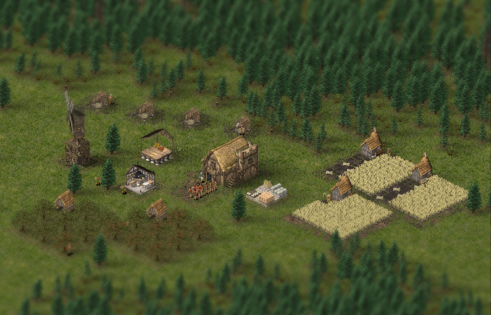

  

  
  

 

  

 

Open source fan remake of the famous Stronghold from Firefly Studios

Experience the thrill of medieval castle building and destruction in our
isometric, open source strategy game - a modern remake of Firefly Studios'
classic Stronghold. Immerse yourself in a world of strategy and tactical
decision making as you design and defend your own castles in medieval Europe.

## Prerequisites for development
1. Install [Git Large File Storage](https://git-lfs.github.com/)
2. Install LÖVE 11.4 from the [official website](https://love2d.org/)

## Install from source

1. Download the repository from [here](https://gitlab.com/kaylemaster/stone-kingdoms/-/archive/master/stone-kingdoms-master.zip) or clone via git
2. Open terminal or command line in the directory where `main.lua` is located
3. Run `love .` and play!

## Links
* [Discord server](https://discord.gg/PRh8SPZxEf)

## How to contribute
Contact Kayle in the discord server for more instructions.
We can use help in the programming, design and game balance department.

## License

Stone Kingdoms is licensed under Apache 2.0 License. See LICENSE.md for more details.

Stone Kingdoms uses image assets, property of Firefly Studios' Stronghold (2001).

Please see respective files for license of the libraries located in /libraries or root directory (busted).
